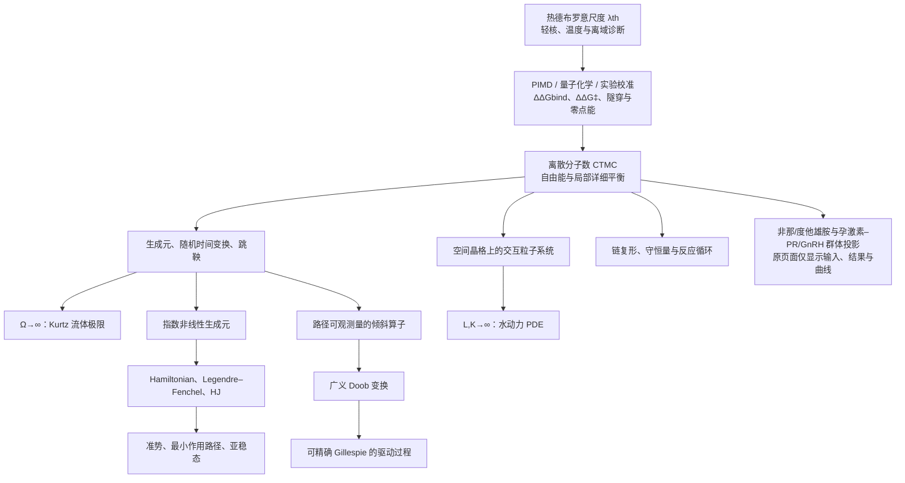

# Mathematical flow audit

This audit maps every requested arrow to an executable Kotlin object, a machine check, and the analytical boundary that code must not conceal.

The quantum branch is deliberately one-way through `Q1`: no direct `Q --> A` edge exists.

Status vocabulary:

- **implemented** — a typed construction and a test exist;
- **conditional theorem** — the theorem is exposed only after named analytical witnesses are supplied;
- **numerical candidate** — residual-bearing computation, never promoted to proof;
- **model input open** — the algebra is implemented, but physical identification/calibration is deliberately not invented.

## Flowchart coverage

`FinasterideMicroscopicNetwork` adds absorption/redistribution, elimination/reservoir return,
`FIN + SRD5A2 ⇄ SRD5A2·NADP-DHF`, `FIN + SRD5A1 ⇄ SRD5A1·FIN`, and the two
isoenzyme-specific `T ⇄ DHT` channels. `FinasterideRigorousPipeline` passes that single reaction
table to the exact generator, density symbol and stoichiometric chain complex; the existing
random-time-change, martingale, nonlinear-generator/Hamiltonian, Doob, metastability and spatial
constructors consume those same generic objects. None of those names or derivations is rendered
by `webApp`; the browser projection is restricted to regimen input, 5αR1/5αR2 outputs, serum-DHT
suppression and the time curves.

`DutasterideMicroscopicNetwork` uses the corresponding dual-enzyme channels
`DUT + SRD5A1 ⇄ SRD5A1·DUT` and `DUT + SRD5A2 ⇄ SRD5A2·DUT`. Its structural record
explicitly marks PDB `7BW1` as a related 4-azasteroid template rather than pretending that a direct
dutasteride complex was observed. `DutasterideRigorousPipeline` applies the same single-source
generator/density/chain rule. `embeddedEngine` is parity-tested against both JVM models and writes
only dose/time observables into the existing Hrt-kaffee page; it never renders the internal theorem or
operator names.

`ProgestogenGnRHMicroscopicNetwork` adds `PG + PR ⇄ PR·PG` and reversible
`GNRH_READY ⇄ GNRH_INHIBITED` feedback channels to reversible PK reservoir channels. Its structural
record assigns PDB `1A28` to the observed human PR–progesterone complex and explicitly rejects a
direct progesterone–GnRH-receptor assignment. `ProgestogenGnRHRigorousPipeline` passes the same
network into the exact generator, density symbol and chain complex; the generic random-time-change,
nonlinear-generator/Hamiltonian, Doob/Gillespie and spatial/PDE checks consume it in the integration
test. The original progestogen panel renders only regimen inputs, PR/GnRH observables and curves.

| Requested node or arrow | Status | Kotlin realization and check | Honest boundary |
|---|---|---|---|
| Thermal de Broglie scale → quantum binding calibration → CTMC | implemented boundary; model input open | `ThermalDeBroglie`, `QuantumBindingBridge`, and `ExactQuantumRateCalibration`; inverse-square-root, rate-ratio, provenance, and named-reaction tests | `λ_th` alone never determines `ΔG_bind`, `ΔG‡`, or a rate multiplier; those require an audited path-integral/quantum-chemistry or experimental input |
| Discrete molecule-count CTMC | implemented | `ReactionNetwork`, falling-factorial propensities, `ExactGenerator`; exact sign and row-sum checks | The selected species/state space is a modelling choice |
| Free energy and local detailed balance | implemented; model input open | `ExactActivity`, `FormalFreeEnergy`, `LocalDetailedBalance`; exact rational rate-ratio audit | AR state free energies, activity coefficients, and reservoir driving factors require physical identification |
| CTMC → generator, random time change, jump martingale | implemented | `ExactGenerator`, reaction-labelled `ReactionNetworkGillespieSimulator`, `RandomTimeChange.stateEquation`, `DynkinMartingale`; integer state-clock identity and exact carré-du-champ bound | Infinite-state/infinite-horizon extensions need localization, Lyapunov non-explosion and uniform-integrability arguments |
| Generator → Kurtz fluid limit as Ω→∞ | conditional theorem | `DensityScaledReactionFamily`, `ReactionNetworkLimit`, `kurtzFluidLimitClaim`; exact scaling plus named Lipschitz/containment/initial-data gates | RK4 output is not the convergence proof |
| Generator → exponential nonlinear generator | implemented | `ExponentialNonlinearGenerator` evaluates `N⁻¹e^(−Nf)L_Ne^(Nf)` for linear exponential tests and compares it with the jump Hamiltonian | The finite-N comparison is numerical after evaluating exponentials; scaled intensities remain exact rationals |
| Nonlinear generator → Hamiltonian | implemented | `DensityDependentModel.hamiltonian` from the same reaction channels; `H(x,0)=0` and gradient checks | Domain and coercivity are model-specific |
| Hamiltonian → Legendre–Fenchel → HJ | implemented with numerical certificate | damped-Newton dual with gradient residual; explicit HJ residual evaluator | No viscosity-solution theorem is inferred from a small residual |
| Action → quasipotential/minimum-action path | conditional theorem + numerical candidate | `samplePathLargeDeviationClaim`, `quasipotentialClaim`, `PathAction`, `FixedTimeMinimumActionSolver` | The solver certifies only a fixed-time/fixed-mesh stationary candidate, not the global path/time infimum |
| Quasipotential → metastability | conditional theorem + finite-state diagnostics | `metastableExitClaim`, exact MFPT, killed-generator QSD | A metastable claim needs internal-mixing/escape scale separation |
| Generator → tilted path-observable operator | implemented | `TiltedOperator`; it intentionally does not implement `StochasticGenerator` | Observable domain and spectral assumptions must be declared |
| Tilted operator → generalized Doob transform | implemented with numerical certificate | principal positive eigenpair residual, then `GeneralizedDoobTransform` | A failed eigenpair residual blocks construction |
| Doob transform → Gillespie driven process | implemented | only `DrivenGenerator` implements `StochasticGenerator`; an actual driven path is sampled in tests | This samples the driven process, never the raw tilted operator |
| CTMC → spatial lattice IPS | implemented as an optional spatial extension | `PeriodicSpatialLattice` replicates the same local reaction table and adds bidirectional `D L²` hops | Do not activate this layer merely for formal decoration when the system is genuinely well mixed |
| Spatial IPS → hydrodynamic PDE as L,K→∞ | conditional theorem + numerical PDE | spatial-generator, diffusive-scaling, replacement/local-equilibrium, and tightness gates; PDE reaction drift comes from the same local network | A finite-volume solution alone cannot prove the hydrodynamic limit |
| CTMC → chain complex, conservation, cycles | implemented | `Simplex.face(i)`, exact `∂²=0`, and `StoichiometricChainComplex`; exact left/right kernels of the stoichiometric boundary | Kotlin is the implementation language, not a chain group |

## Resolution of the conceptual questions

| Question | Resolution enforced by the codebase |
|---|---|
| Must the large-deviation Hamiltonian be Fourier transformed? | No. The implemented route is the exponential nonlinear generator followed by the Hamiltonian. No Fourier transform appears in the core. Fourier methods would be an optional special-case solver for linear/translation-invariant problems. |
| What is “Hamilton–Lebesgue”? | The required pair is Hamilton–Jacobi plus Legendre–Fenchel. Lebesgue integration supplies the measure/integration setting for the action; it is not a transform from `H` to `L`. |
| Can the raw tilted operator be run in Gillespie? | No. The type boundary forbids it. A positive principal eigenpair and generalized Doob transform are required first. |
| Does random sampling require a continuous martingale? | No. The reaction path is encoded as càdlàg and pure jump. Gillespie uses exponential holding times/competing reaction clocks; compensated reaction counts are jump martingales. |
| Must every martingale path be bounded? | No. The current finite reachable state space gives bounded rates/test functions and hence integrability. General unbounded extensions must use stopping/localization, a Lyapunov non-explosion estimate, bracket control, and uniform integrability only where the desired limit needs it. |
| Is the well-mixed limit already hydrodynamic? | No. `limit/` handles the Ω or N Kurtz limit. `hydrodynamic/` first constructs a spatial lattice generator and then requires the separate L,K scaling and replacement/tightness witnesses. |
| Should an interacting particle system always be introduced? | No. It is an optional spatial lift. Use it for spatial correlation, crowding, phase separation, or short-range effects; otherwise retain the well-mixed CTMC. |
| How is metastability treated? | The preferred route is sample-path action and quasipotential, with scale-separation gates. Langevin diffusion is not used as the proof; it may only be a later cross-check. |
| Must the system be Bose/Fermi or admit a virial expansion? | No. The core uses activities, formal free-energy weights and local detailed balance. It makes no quantum ideal-gas or virial-expansion assumption. A stronger correlated model belongs in an explicitly declared lattice Gibbs/IPS extension. |
| Can a thermal de Broglie wavelength be used as a direct molecular-binding multiplier? | No. It is a diagnostic length scale. Nuclear quantum effects enter the CTMC only after a system-specific calculation identifies binding/activation free-energy shifts or rate corrections; the exact generator then accepts only explicit rational multipliers with provenance. |
| Do Doi–Peliti “bosonic” operators imply bosonic molecules? | No. They would only be occupation-number bookkeeping. This implementation has no Doi–Peliti dependency at all. |
| Is Kotlin the i-th face of a singular chain group? | No. Kotlin implements `face(i)`, chains, boundaries and exact `∂²=0`; it is not itself a mathematical chain group. |
| Can numerical code prove the limit theorem? | No. `EvidenceKind` separates exact identity, conditional theorem, numerical certificate, Monte Carlo estimate and illustrative parameterization. Failed analytical assumptions block theorem construction. |

## What remains scientifically open

The software flow is present, but the following are intentionally **not** claimed for the illustrative AR parameters:

1. identified patient-specific activities, free energies, reservoir chemical potentials, or rate constants;
2. a proved AR-specific sample-path LDP, coercive quasipotential, or global minimum-action path;
3. a proved AR-specific replacement lemma/tightness theorem for the spatial lattice;
4. a clinical efficacy, dose-conversion, safety, or “total blockade percentage” result.
5. AR-specific nuclear-quantum binding or activation corrections from PIMD, instanton/quantum-rate theory, quantum chemistry, or isotope-calibrated experiment.

Those are missing scientific inputs/proofs, not gaps that a successful unit test is allowed to erase.
